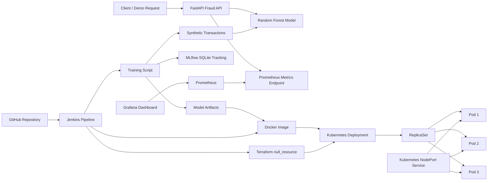

# Architecture

This project is a local-first MLOps MVP for real-time financial transaction fraud detection.

## Components

- `model/train.py` creates an imbalanced synthetic dataset with `make_classification`, trains `RandomForestClassifier`, logs metrics to MLflow, and saves model artifacts.
- `app/main.py` serves `/predict`, `/health`, `/ping`, `/metrics`, and Swagger documentation.
- Docker packages the FastAPI service and generated artifacts.
- Terraform calls the local PowerShell provisioning script to start Minikube, load the Docker image, and deploy Kubernetes resources.
- Prometheus scrapes `fraud-detection-service:8000/metrics`.
- Grafana provisions a default Prometheus datasource and fraud dashboard.
- Jenkinsfile documents a realistic Windows CI/CD pipeline.

